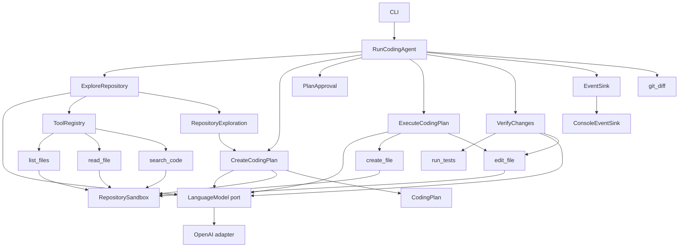

# Mini Coding Agent

Mini Coding Agent is a small TypeScript coding agent built to make agentic software engineering understandable. Instead of hiding behavior behind an agent framework, it exposes the loop, tools, structured decisions, safety boundaries, and tests that drive the system.

> Current status: the complete V0.4 workflow and typed console observability are functional. The reproducible sample-project demo and final portfolio review are the remaining milestone.

## Quick Start

Requirements:

- Node.js 20.19 or newer
- npm
- An OpenAI API key
- A local repository you trust

```bash
npm install
```

Set the API key in your shell. The application reads environment variables directly and does not load `.env` files.

PowerShell:

```powershell
$env:OPENAI_API_KEY="your-api-key"
$env:OPENAI_MODEL="gpt-5.6" # Optional
```

Bash or Zsh:

```bash
export OPENAI_API_KEY="your-api-key"
export OPENAI_MODEL="gpt-5.6" # Optional
```

Explore the current repository:

```bash
npm run dev -- "Prevent users from registering with invalid email addresses" --repo .
```

Explore another repository:

```bash
npm run dev -- "Add expiration handling to password reset tokens" --repo ../another-project
```

The current version reports relevant files and an ordered implementation plan, asks for approval, executes approved tasks, runs `npm test`, applies bounded corrections when tests fail, and shows the final Git diff.

## What Is Mini Coding Agent?

Mini Coding Agent is a portfolio and learning project that implements the mechanics of a coding agent explicitly:

- an observable `observe -> decide -> act -> observe` loop;
- structured LLM outputs validated with Zod;
- a registry of limited, testable tools;
- explicit bounds on autonomous behavior;
- provider-independent application logic;
- deterministic tests without network calls.

It is intentionally smaller than Claude Code, Codex, or OpenCode.

## Why This Project Exists

Many agent examples reduce the implementation to one large prompt or delegate the important behavior to a framework. This project explores the engineering decisions underneath those abstractions:

- How does an agent decide which capability to use next?
- How are LLM outputs converted into trusted application data?
- How can filesystem access be constrained?
- How do we prevent hallucinated files from becoming accepted results?
- How can the workflow be tested without a real model?
- How should retries and human approval fit into the state machine?

The goal is educational clarity and credible engineering, not feature parity with production coding agents.

## Current Capabilities

| Capability | Status |
| --- | --- |
| CLI goal and repository selection | Available |
| Repository file listing | Available |
| Text file reading | Available |
| Literal code search | Available |
| Structured relevance assessment | Available |
| Bounded exploration loop | Available |
| Structured coding plan | Available |
| Human approval | Available |
| File creation and editing | Available |
| Final Git diff | Available |
| Test and correction loop | Available |
| Typed event stream | Available |

## Architecture



The application layer depends on ports and structured contracts. OpenAI and filesystem details stay in the outer CLI and infrastructure layers. Tests replace OpenAI with a queue-based `FakeLanguageModel`.

See [Technical Architecture](docs/technical-architecture.md) for boundaries, contracts, safety controls, and tradeoffs.

## Agent Loop

Repository exploration uses one explicit decision per iteration:

```text
observe goal and previous tool results
              |
              v
ask for one structured decision
              |
              v
validate the decision with Zod
              |
              v
execute one registered read-only tool
              |
              v
record the structured observation
              |
              +----------> repeat, up to 12 steps
```

The model may choose `list_files`, `read_file`, `search_code`, or `complete`. A completion is rejected if it references files that were not discovered by a tool.

After exploration, a separate structured generation creates ordered tasks. Existing files can only be marked `modify` when exploration identified them, while `create` targets must be safe relative paths that do not already exist. The CLI asks for explicit approval, then each task receives a structured full-content proposal restricted to the approved files and operations.

After execution, the agent runs the repository's fixed `npm test` script. A failure can produce a structured correction for approved files, followed by another test run. Verification stops after three total test attempts, so at most two corrections are applied.

Every phase emits typed events for tools, tasks, files, verification attempts, corrections, diff generation, and terminal outcomes. Event payloads are cloned and frozen before delivery; observability failures do not change agent behavior.

## Safety

The current implementation follows least capability:

- no generic shell tool;
- no generic shell, delete, Git mutation, or arbitrary network tools;
- no file change before explicit human approval;
- repository-relative paths only;
- `realpath` containment checks;
- symlinks outside the repository are rejected;
- common secret, dependency, build, and VCS paths are excluded;
- binary and oversized file reads are constrained;
- search and traversal results are bounded;
- exploration stops after 12 model decisions;
- planned modifications are limited to explored files;
- planned creations cannot overwrite existing or restricted paths.
- execution proposals cannot add files or change approved operations;
- verification corrections can edit only approved plan files;
- tests run at most three times, with a 120-second and 200 KB output bound per run;
- Git is validated before model calls or writes;
- the final diff is bounded to 5 MB.

Running an agent against a repository sends selected repository content to the configured model provider and executes that repository's `npm test` script. Only use repositories you are authorized to inspect and execute.

## What This Project Explores

- planning;
- tool usage;
- explicit agent state;
- structured outputs;
- human-in-the-loop workflows;
- verification and self-correction loops;
- safe autonomous modifications;
- observability;
- testable ports and adapters.

## What This Project Intentionally Does Not Do

- arbitrary shell access;
- IDE integration;
- GitHub automation;
- automatic pushes or pull requests;
- persistent memory, embeddings, or RAG;
- multi-agent orchestration;
- support for every language and build system.

## Roadmap

| Milestone | Outcome | Status |
| --- | --- | --- |
| 1. Bootstrap | TypeScript CLI, model port, tool registry | Complete |
| 2. Exploration | Safe list, read, search, and relevance selection | Complete |
| 3. Planning | Ordered structured plan and verification strategy | Complete |
| 4. Execution | Approval, file changes, and diff generation | Complete |
| 5. Verification | Tests, failure analysis, and bounded correction | Complete |
| 6. Observability | Typed events and console event sink | Complete |
| 7. Portfolio polish | Example project and final documentation | Next |

## Documentation

| Document | Audience | Purpose |
| --- | --- | --- |
| [Product and Business](docs/product-and-business.md) | Product, recruiters, collaborators | Problem, value, scope, and success measures |
| [Technical Architecture](docs/technical-architecture.md) | Engineers and reviewers | Components, runtime flow, safety, and tradeoffs |
| [User Guide](docs/user-guide.md) | CLI users | Installation, configuration, usage, and troubleshooting |

## Development

```bash
npm test
npm run typecheck
npm run build
```

The test suite is deterministic and does not call OpenAI. It covers model fakes, state transitions, structured schemas, tool validation, traversal protection, approval, execution, verification retries, correction allowlists, process/output limits, ordered events, sink isolation, Git diff generation, and CLI rendering.

## Future Experiments

- patch-based editing;
- context-window management;
- agent memory;
- behavior and safety evals;
- planner/builder multi-agent architecture;
- alternative language-model adapters.
