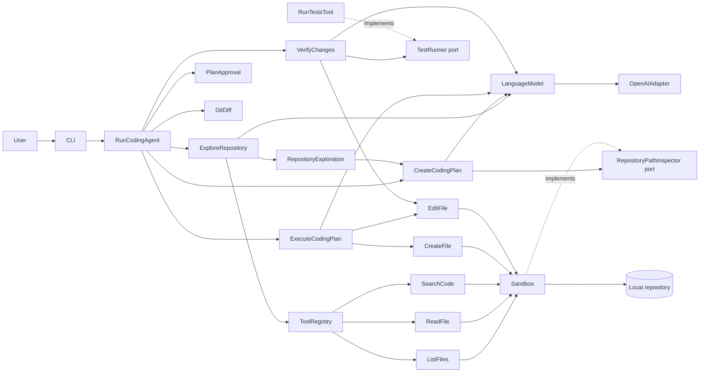
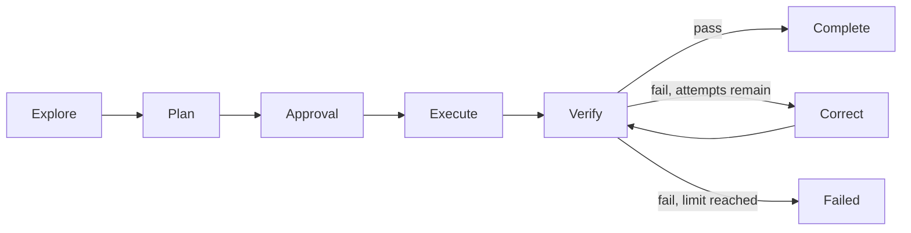

# Technical Architecture

Mini Coding Agent uses a small Ports and Adapters structure to keep the agent workflow explicit, provider-independent, and testable. The current implementation delivers the complete V0.4 workflow through bounded verification and correction. Typed observability events remain the next milestone.

## Architecture at a Glance



The dependency direction is inward:

```text
CLI and infrastructure adapters
              |
              v
application workflows and ports
              |
              v
domain schemas and results
```

Application code does not import the OpenAI SDK or Node filesystem adapters. Repository tool schemas are ports because they define the capability contract shared by the workflow and its adapters.

## Current Source Structure

```text
src/
  agent/
    application/
      CreateCodingPlan.ts
      ExecuteCodingPlan.ts
      ExploreRepository.ts
      RunCodingAgent.ts
      ToolRegistry.ts
      VerifyChanges.ts
    domain/
      AgentState.ts
      CodingPlan.ts
      ExplorationDecision.ts
      RepositoryPathPolicy.ts
      RepositoryExploration.ts
      TaskExecutionProposal.ts
      VerificationCorrection.ts
      VerificationResult.ts
    ports/
      ChangeDiff.ts
      FileMutationTools.ts
      LanguageModel.ts
      PlanApproval.ts
      RepositoryPathInspector.ts
      RepositoryTools.ts
      Tool.ts
      TestingTools.ts
    infrastructure/
      llm/
        OpenAILanguageModel.ts
      tools/
        code/
          SearchCodeTool.ts
        filesystem/
          CreateFileTool.ts
          EditFileTool.ts
          ListFilesTool.ts
          ReadFileTool.ts
          RepositorySandbox.ts
          walkRepository.ts
        git/
          GitDiffTool.ts
        testing/
          RunTestsTool.ts
  cli/
    ConsolePlanApproval.ts
    main.ts
  main.ts
```

Tests mirror these boundaries under `tests/` and provide `tests/helpers/FakeLanguageModel.ts` for deterministic model behavior.

## Runtime Flow

### 1. CLI Composition

`src/cli/main.ts` is the composition root.

It:

1. Parses the goal and optional `--repo` path.
2. Confirms the repository exists and is a directory.
3. Resolves the repository's real path.
4. Creates one `RepositorySandbox`.
5. Registers read-only exploration tools and create/edit tools.
6. Creates `OpenAILanguageModel`, unless a model was injected by a test.
7. Creates `RunCodingAgent` with exploration, planning, execution, verification, approval, and diff dependencies.
8. Validates that the selected path is inside a Git working tree.
9. Runs exploration and planning.
10. Renders the plan through `ConsolePlanApproval` and asks `[y/N]`.
11. On cancellation, prints confirmation and exits without writes or a diff.
12. On approval, executes tasks sequentially, runs bounded verification, applies approved-file corrections when needed, and renders final state, test attempts, modified files, failures, and diff.

No dependency injection container or factory layer is used. Wiring remains visible because there are only a few dependencies.

### 2. Observe, Decide, Act

`ExploreRepository` runs a bounded loop:

```text
goal + previous observations
             |
             v
LanguageModel.generate(ExplorationDecisionSchema)
             |
             v
list_files | read_file | search_code | complete
             |
             v
ToolRegistry validates input and output
             |
             v
structured observation is appended
```

Only one action is allowed per model response. The loop stops when:

- the model returns a valid `complete` decision; or
- 12 decisions have been attempted, producing a controlled error.

### 3. Completion Validation

The workflow records every file returned by listing, reading, or searching. A `complete` decision is accepted only if each relevant path maps to a previously observed file.

This prevents a plausible but invented model path from becoming a trusted exploration result.

Windows comparisons are case-insensitive. Returned paths use the canonical casing observed from the filesystem tools.

### 4. Structured Planning

`CreateCodingPlan` sends the original goal and validated exploration result through `CodingPlanSchema`. The returned plan is normalized and checked before the CLI displays it.

Planning invariants are:

- task IDs are unique;
- each task references at least one file;
- one task cannot reference the same file twice;
- separate tasks cannot create the same path twice;
- plan path identity is case-insensitive on every platform to prevent non-portable collisions;
- `modify` targets must be relevant exploration results and still exist;
- `create` targets must not already exist;
- `create` targets must have an existing immediate parent directory;
- every path must be relative, portable, and outside restricted locations;
- the original user goal remains authoritative even if the model rewrites it.

The planner does not write files. These constraints define the candidate change set presented to human approval before execution.

## Core Contracts

### Language Model

```ts
interface StructuredGenerationRequest<T> {
  schemaName: string
  schema: z.ZodType<T>
  instructions: string
  input: string
}

interface LanguageModel {
  generate<T>(request: StructuredGenerationRequest<T>): Promise<T>
}
```

The application supplies a Zod schema with every request. `OpenAILanguageModel` translates it to the Responses API through `zodTextFormat`, then validates the parsed response again before returning it.

The default model is `gpt-5.6`. `OPENAI_MODEL` can override it without changing application code.

### Structured Exploration Decision

OpenAI strict structured outputs require an object at the root. The decision is therefore wrapped:

```ts
{
  decision:
    | { action: 'list_files'; path: string }
    | { action: 'read_file'; path: string }
    | { action: 'search_code'; path: string; query: string }
    | {
        action: 'complete'
        relevantFiles: Array<{ path: string; reason: string }>
        summary: string
      }
}
```

The LLM does not return Markdown that must be manually parsed.

### Coding Plan

```ts
interface CodingPlan {
  goal: string
  tasks: Array<{
    id: string
    description: string
    files: Array<{
      path: string
      operation: 'create' | 'modify'
      reason: string
    }>
    verification: {
      expectedOutcome: string
    }
  }>
  verificationStrategy: string
}
```

The plan is a strict Zod object compatible with OpenAI structured outputs. File-level reasons make the approval boundary reviewable without parsing free-form prose.

### Task Execution Proposal

After approval, each task produces one strict object containing the task ID and complete content for every approved file. `ExecuteCodingPlan` rejects proposals that add, omit, repeat, rename, or change the operation of a file before writing that task.

Modified files are re-read immediately before their task, so later tasks observe earlier successful changes. Proposal content is limited to 1,000,000 characters per file.

### Repository Path Inspector

`RepositoryPathInspector` exposes `exists(relativePath)` and `assertCanCreate(relativePath)`. `RepositorySandbox` implements the port, allowing the planner to prevent overwrite and require an existing, safe immediate parent without depending on filesystem infrastructure. For missing targets, the sandbox resolves the nearest existing ancestor so a new path cannot hide beneath an external or dangling symlink.

### Tool

```ts
interface Tool<TInput, TOutput> {
  name: string
  description: string
  inputSchema: z.ZodType<TInput>
  outputSchema: z.ZodType<TOutput>
  execute(input: TInput): Promise<TOutput>
}
```

`ToolRegistry` owns the dynamic boundary where input is still `unknown`. It validates input, executes the selected tool, validates output, and returns a discriminated result.

```ts
type ToolResult<T> =
  | { ok: true; value: T }
  | {
      ok: false
      error: {
        code: 'unknown-tool' | 'invalid-input' | 'invalid-output' | 'execution-failed'
        message: string
        details?: unknown
      }
    }
```

Application workflows can observe expected tool failures without using exceptions as control flow.

### Agent State

`RunCodingAgent` owns explicit state with these statuses:

```text
exploring -> planning -> awaiting-approval -> executing -> verifying -> completed
                                      |           |          |
                                      v           v          v
                                  cancelled     failed     failed
```

State records exploration, plan, completed and failed task IDs, modified files, final diff, verification attempts, the last test result, correction analyses, and a controlled failure reason.

## Read-Only Tools

| Tool | Input | Output | Default bounds |
| --- | --- | --- | --- |
| `list_files` | Relative directory path | Files, directories, truncation flag | 200 returned entries, depth 5, 800 inspected entries |
| `read_file` | Relative file path | Decoded text prefix and truncation flag | CLI configuration: first 1,000,000 bytes |
| `search_code` | Relative directory and literal query | Path, line, text, truncation flag | 50 matches, 300 returned entries, up to 1,200 inspected entries, depth 8, first 64,000 bytes per file |

Search is a case-insensitive literal match, not a regular expression. A file is treated as binary only when its inspected prefix contains a NUL byte. Other byte sequences are decoded as UTF-8 and may contain replacement characters.

## Write and Diff Capabilities

| Capability | Behavior | Bound |
| --- | --- | --- |
| `create_file` | Writes a temporary file, syncs it, then hard-links it to a new target without overwrite | 1,000,000 characters |
| `edit_file` | Writes and syncs a temporary file, preserves mode bits, then atomically renames it over the target | 1,000,000 characters |
| `git_diff` | Compares the selected repository subtree with `HEAD`, or the object-format-specific empty tree for an unborn repository | 5 MB aggregate, 1,000 untracked files, 4,000 inspected entries |

Git is validated before exploration, model calls, approval, or writes. The diff is scoped to the selected path and includes staged, unstaged, and non-ignored untracked file content in that subtree, including pre-existing changes. Untracked paths are containment-checked with `realpath`; symlinks encountered during expansion are rejected.

Create and edit tools receive only paths and complete content already validated against the approved task. There is no delete, rename, arbitrary patch, shell, commit, reset, push, or publish capability.

## Verification Capability

`RunTestsTool` exposes only an empty input and always launches the repository's `npm test` script with fixed arguments. The LLM cannot provide a command, executable, argument, or environment variable.

`VerifyChanges` runs tests at most three times. After the first or second failure it may request one structured correction containing complete content for a subset of approved plan files. The entire correction is validated before its first write. It cannot create, delete, rename, or add a path.

Each run captures exit code, stdout, stderr, duration, timeout, and truncation state. A passing exit requires code zero without timeout or output truncation.

## Repository Sandbox

Every filesystem tool shares one `RepositorySandbox` created from the selected root.

### Path Validation

The sandbox rejects:

- empty paths;
- POSIX and Windows absolute paths;
- any `..` segment;
- `:` segments, including Windows alternate data streams;
- paths whose real target is outside the repository;
- restricted names before and after `realpath` resolution.

Directory walking does not follow symbolic links. A direct read through a symlink is allowed only when its real target remains inside the root and is not restricted.

### Restricted Content

The explorer skips common sources of secrets, dependencies, generated output, and VCS metadata:

```text
.aws
.git
.git-credentials
.netrc
.npmrc
.pypirc
.ssh
.venv
coverage
dist
node_modules
vendor
venv
```

It also excludes:

- `.env` and `.env.*`, except `.env.example`;
- `id_rsa` and `id_ed25519`;
- files ending in `.key` or `.pem`.

Checks are case-insensitive so the policy also holds on Windows filesystems.

### Trust Boundary

The CLI is designed for repositories the user trusts and is authorized to send to the configured model provider.

The sandbox protects against deterministic traversal and symlink escapes. Node.js does not expose a portable descriptor-relative `openat` workflow, so it cannot fully prevent a malicious local process from replacing a validated path between validation and access. Concurrent adversarial filesystem mutation is outside the MVP threat model.

Approved tasks are sequential but not transactional. If a later write fails, earlier writes remain and are recorded in `modifiedFiles`. Non-ignored changes within the selected Git subtree appear in the final diff. There is no automatic rollback. Atomic replacement preserves mode bits, but a new inode may not preserve ownership, ACLs, or extended attributes on every filesystem.

`npm test` executes repository-controlled code. The runner requests termination at its timeout and resolves after a one-second grace period even if process pipes remain open. POSIX process groups receive `SIGTERM` followed by `SIGKILL`; Node cannot portably guarantee termination of every resistant descendant on Windows. This is part of the trusted-repository boundary.

## Resource Bounds

Resource limits protect cost, latency, and context size:

| Resource | Limit |
| --- | --- |
| Model decisions per exploration | 12 |
| Listed entries | 200 |
| Listing depth | 5 |
| Inspected directory entries | 4 times the configured return limit |
| Direct file read in the CLI | 1,000,000 bytes |
| Search matches | 50 |
| Search traversal | 300 returned entries, up to 1,200 inspected entries, depth 8 |
| Search content per file | 64,000 bytes |
| File mutation proposal | 1,000,000 characters per file |
| Final Git diff | 5,000,000 bytes aggregate |
| Untracked files in diff | 1,000 |
| Inspected entries while expanding untracked directories | 4,000 |
| Verification attempts | 3 total |
| Test runtime per attempt | 120,000 ms plus 1,000 ms termination grace |
| Captured test output per attempt | 200,000 bytes across stdout and stderr |
| Correction changes | 20 files, 1,000,000 characters per file |
| Correction aggregate content | 2,000,000 UTF-8 bytes |

When a traversal or content limit is reached, tools set `truncated: true`. Exploration can continue, but the model must reason from incomplete evidence.

The directory walker uses `opendir` streaming instead of loading an entire directory into memory. When an extreme directory exceeds the inspection limit, which entries appear before truncation can depend on filesystem iteration order.

## Error Handling

Errors are handled at two levels:

| Boundary | Behavior |
| --- | --- |
| CLI configuration | Throws a concise user-facing error and exits non-zero |
| Tool invocation | Returns a controlled `ToolResult` failure |
| Invalid LLM structure | Zod/OpenAI parse rejects the generation |
| Invented completion path | Adds `completion_rejected` observation and continues |
| Exploration limit | Throws a controlled limit error |
| Invalid plan structure | Zod/OpenAI parse rejects the generation |
| Unsafe or inconsistent plan path | Planning fails before approval or execution |
| Approval rejected | State becomes `cancelled`; no write tool runs |
| Invalid execution proposal | Current task fails before its first write |
| Write failure | State becomes `failed`; earlier successful writes remain tracked |
| Test failure with attempts left | Model analyzes output and proposes an approved-file correction |
| Third test failure | State becomes `failed`; no third correction is requested |
| Invalid correction | State becomes `failed` before any correction file is written |
| Test runner failure | State becomes `failed` with a controlled synthetic result |
| Diff failure | State becomes `failed` while preserving any execution failure reason |

## Testing Strategy

The test suite uses Vitest and does not make network calls.

### Model Boundary

`FakeLanguageModel` consumes a queue of predefined responses. It validates each response with the schema supplied by the application and records requests for assertions.

Covered behavior includes:

- queued response order;
- schema rejection;
- missing fake responses;
- OpenAI request mapping;
- missing structured output;
- OpenAI-compatible object-root decision schema.

### Tool Boundary

Tool tests use real temporary directories and files.

Covered behavior includes:

- listing and exclusions;
- bounded reads and the NUL-byte binary heuristic;
- path traversal rejection;
- case-insensitive secret restrictions;
- NTFS alternate data stream rejection;
- external symlink rejection;
- literal search and line numbers;
- no-overwrite file creation and atomic full-content edits;
- Git validation, staged/untracked diff content, and symlink containment;
- registry input/output validation;
- controlled execution failures.
- fixed `npm test` success, failure, timeout, output bounds, and rejected command input.

### Application Boundary

Application tests combine real or focused repository boundaries with `FakeLanguageModel`.

Covered behavior includes:

- sequential decisions;
- observations passed to the next decision;
- relevant-file collection;
- invented-path rejection;
- Windows path casing;
- finite positive step limits;
- termination at the configured maximum.

Planning coverage includes:

- OpenAI-compatible structured plan schema;
- canonical user goals and paths;
- unique task IDs and task-local file references;
- explored-file requirements for modifications;
- existence checks for modifications and creations;
- restricted, traversal, and non-portable path rejection;
- CLI rendering of ordered tasks and verification strategy.

Execution coverage includes:

- valid and invalid state transitions;
- approval cancellation with zero writes;
- sequential tasks observing previous writes;
- strict approved-file and operation enforcement;
- partial write failure tracking;
- pre-write Git validation;
- final state, modified files, and diff rendering.

Verification coverage includes:

- pass on the first attempt without an LLM correction;
- fail, correct, and pass on a later attempt;
- failure after exactly three attempts and two corrections;
- approved-file enforcement and validation before writes;
- aggregate correction bounds and controlled runner failures;
- final diff generation after successful or failed verification.

### Verification Commands

```bash
npm test
npm run typecheck
npm run build
npm audit
```

## Design Decisions and Tradeoffs

### Explicit Loop Instead of Framework Orchestration

The loop is ordinary TypeScript so reviewers can see iteration, limits, observations, and tool selection directly. This costs some framework convenience but serves the educational goal.

### Full Observations Instead of Context Management

The current loop sends accumulated bounded observations back to the model. Context selection and summarization are intentionally deferred until there is evidence they are needed.

### Literal Search Instead of Regex or Ripgrep

Literal search avoids regex injection and external binary dependencies. It is less powerful and less scalable than ripgrep, which is acceptable for the initial language-neutral explorer.

### Full-Content Editing Before Patch Editing

Execution reads current content, requests complete updated content, validates the entire proposal against the approved task, and writes within the sandbox. This is easier to validate than arbitrary patches but consumes more context. Patch-based editing remains a future experiment.

### Partial Changes Remain Visible

Tasks are not rolled back automatically. Preserving successful writes, explicit modified-file tracking, and the final diff makes failure observable without introducing a fragile transaction layer over the filesystem.

## Planned Evolution



The remaining planned addition is typed `AgentEvent` output through an `EventSink` port, followed by the reproducible sample-project demo and final portfolio review.

## Review Checklist

When the architecture changes, verify:

- Does application code still avoid provider and filesystem SDK details?
- Is every machine-consumed model response schema-validated?
- Is each new capability narrower than a generic command tool?
- Are path, byte, result, step, and retry limits explicit?
- Can the workflow be tested with `FakeLanguageModel`?
- Does the user guide match the real CLI?
- Are planned capabilities still labeled as planned?
